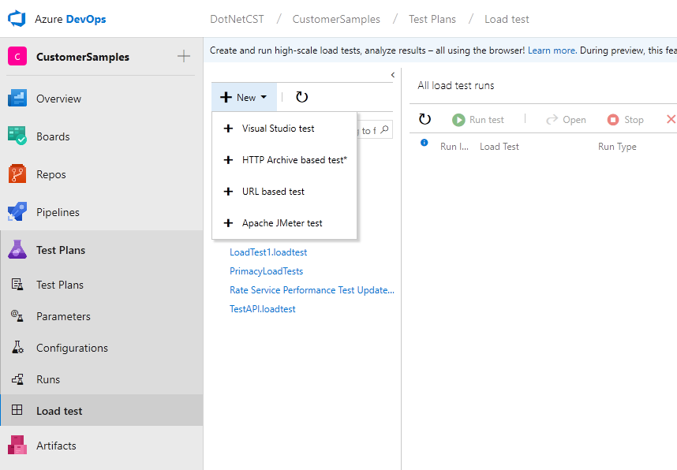
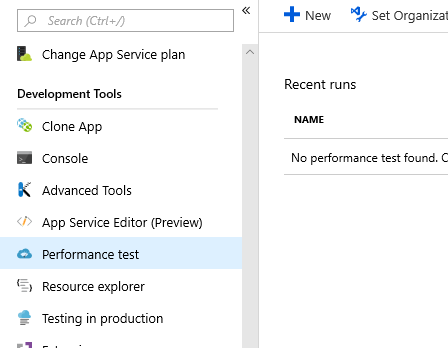
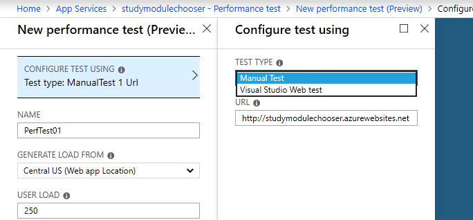

# ASP.NET Core Load/Stress Testing

Load testing and stress testing are both important to ensure a web application is performant and scalable. Their goals are different even they might share similar tests.

**Load tests**: testing whether the application can handle a specified load of users for a certain scenario while still satisfying the business goal? The subject under testing is running under normal conditions.

**Stress tests**: testing How stable is the application when running under extreme conditions (very heavy user load – either spikes or gradually increasing, limited computing resources) over a long period of time? Can the application recover from failure back to normal gracefully? The subject under testing is running under unusual conditions.

[A Wikipedia article](https://en.wikipedia.org/wiki/Software_performance_testing) describes different types of performance testing, include
[load testing](https://en.wikipedia.org/wiki/Software_performance_testing#Load_testing)
and [stress testing](https://en.wikipedia.org/wiki/Software_performance_testing#Stress_testing).

This document describes several notable tools and approaches for load testing and stress testing ASP.NET Core applications.

## Microsoft Supported Tools

### Visual Studio 2017

Visual Studio 2017 allows users to create, develop, and debug web performance and load tests. An option is available to create tests by recording actions in web browser.

[The Load Test blog series](https://blogs.msdn.microsoft.com/charles_sterling/2015/06/01/load-test-series-part-i-creating-web-performance-tests-for-a-load-test/)
by Charles Sterling might seem a little old (from 2015) but most of the topics are still relevant.

[This walk-through](https://docs.microsoft.com/en-us/visualstudio/test/quickstart-create-a-load-test-project?view=vs-2017)
shows how to create, configure, and run a load test projects using Visual Studio 2017.

Load tests can be configured to run in an on-premise performance lab or run in the cloud using Azure DevOps.

## Azure DevOps

Load test runs can be started using the Azure DevOps Test Plans service.

The service supports the following types of test format
- Visual Studio test – web test created in Visual Studio.
- HTTP Archive based test – captured HTTP traffic inside archive is replayed during testing
- [URL-based test](https://docs.microsoft.com/en-us/azure/devops/test/load-test/get-started-simple-cloud-load-test?view=vsts) – allows specifying URLs to load test, request types, headers, and query strings. Run setting parameters such as duration, load pattern, number of users, etc., can be configured.
- Apache JMeter test

##  Azure Portal

[Azure portal allows setting up and running load testing of Web Apps,](https://docs.microsoft.com/en-us/azure/devops/test/load-test/app-service-web-app-performance-test?view=vsts) directly from the Performance tab of the App Service in Azure portal.

The test can be a manual test with a specified URL, or a Visual Studio Web Test file which can test multiple URLs.

At end of the test runs, reports are generated to show the performance characteristics of the application during testing.  Example statistics include
- Average response time
- Max throughput: requests per second
- Failure percentage

## Third-party Tools

There are third-party web performance tools with various feature sets.  Here’s a list of popular ones:
- Apache JMeter – full featured suite of load testing tools. Thread-bound: need one thread per user.
- ab - Apache HTTP server benchmarking tool – simple yet powerful command tool for HTTP/HTTPS load testing
- Gatling – desktop tool with a GUI and test recorders. More performant than JMeter.
- Locust.io – open source. Web-based UI, tests written in Python. Not bounded by threads.
